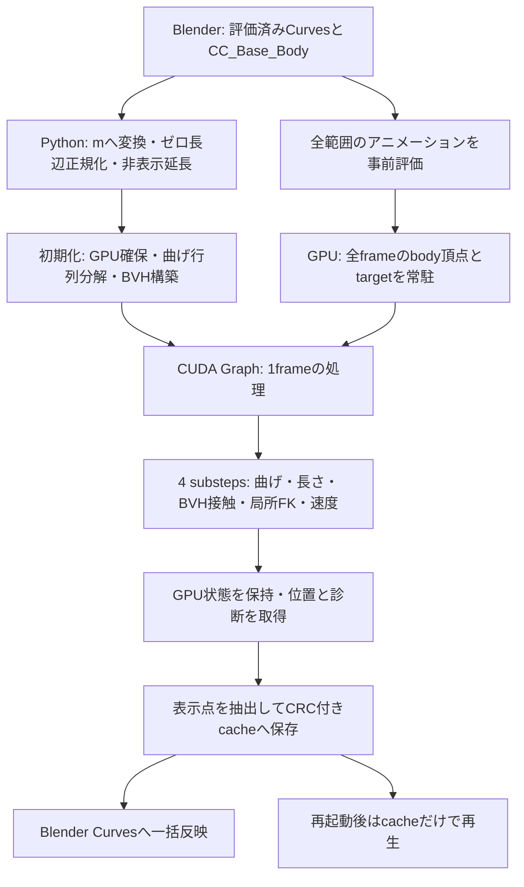
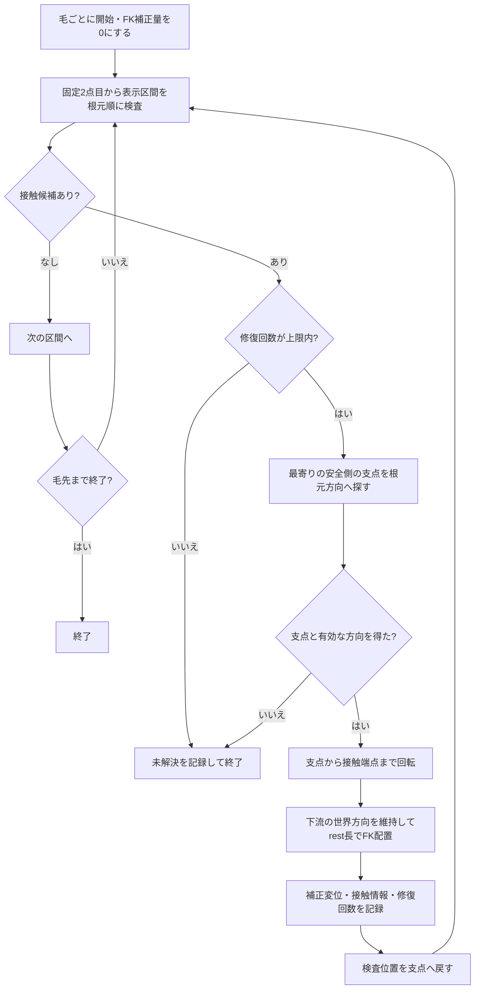

# エーシーズ / 髪4 現行設計書

## 線形曲げ・長さ補正・階層境界箱接触・局所順運動学修復の構成と原仕様との差分

文書版：1.0 / 作成日：2026-09-17 / 対象：ユーザー採用済みの局所順運動学 v2、拡張0.3.0。

本書は、現在動作している方式を再実装・改良・復元できるように記録した設計書である。最初の仕様書を上書きするものではなく、その仕様から保持した部分、ユーザーの指示で変更した部分、未達の条件を対応付ける。文書作成に伴うシミュレーション、物理パラメータ、動的ライブラリ、ブレンダーシーンの変更はない。

| 識別する対象 | 保存点 |
|---|---|
| 現在の採用タグ | `baseline-local-fk-adopted-20260917` |
| 数値実装・表示結果を確定した確定記録 | `eab0400d5615f3c1abe833398ab05d9f15dbf21f` |
| 採用記録の確定記録 | `54a6e33` |
| 対応する結果・バックアップ | `review-local-fk-200f-20260917` |
| 変更前の採用タグ | `baseline-bending50-adopted-20260917` |
| 完全な実行設定 | [採用済みの局所順運動学接触設定](../presets/local-fk-contact-20260917.json) |
| 実装名・画面名 | 原仕様の数値方式名は髪4固定予算分割法。現在のブレンダーパネル名はエーシーズ |

ここでのエーシーズは、旧世代の完全連成エーシーズ-制約付き最適化条件を復活させたという意味ではない。現在の数値コアは、原仕様の線形曲げ・長さ補正・速度力積を維持し、その接触処理を拡張したものである。

読み方：原仕様との違いは第2章、処理全体は第4〜5章、局所順運動学の再実装に必要な内容は第8章、採用設定と実測は第10〜11章、再現と復帰は第13章にまとめている。

## 1. 設計の要点

全体の髪の動きは、事前分解した線形曲げ計算と、固定回数の長さ・接触処理で求める。その後に残った接触だけを、毛ごとに局所順運動学で修復する。

局所順運動学では、衝突した区間の近くにある根元側の関節を支点にする。支点までの正常な部分を動かさず、接触区間を安全側へ回転し、そこから先を長さを保ってつなぎ直す。動かした区間を再検査し、必要な場合だけ同じ毛の修復を続ける。

「戻る」は**毛の中で支点を根元側へ探す**という意味である。過去の時刻へ戻してシミュレーションを再実行する意味ではない。肩付近で衝突した場合も、毎回頭頂まで戻す処理にはしていない。ただし、現在のコードは「肩」という部位名を識別せず、接触面からの距離で支点を選ぶ。

この修復は画像処理装置上のシミュレーション位置を更新する。表示時だけ髪を外へ移して隠す処理ではなく、修復後の位置が次の部分刻みの入力になる。

### 1.1 保持する設計

- 点 / 辺の一次元材料表現。基準辺長、線密度、曲げ剛性、重力、減衰を使う。
- 線形陰的曲げの事前分解と直接解法。
- 長さだけを扱う三重対角系と、速度レベルのクーロン 力積。
- 4 部分刻み数、既定回数の補正回数と反復。接触を含むニュートン / 逐次二次計画法 / 全体制約付き最適化条件収束ループは追加しない。
- 元の髪と身体を入力し、出力カーブ、キャッシュ、保存シーンを分離する。
- 中央処理装置への代替実行や毛の脱落によって失敗を隠さない。

### 1.2 現在の方式の性格

現在は**処理回数に上限を持つ分割方式**である。クーダ グラフの起動構成は一定だが、階層境界箱探索、限定的な連続衝突判定、局所順運動学内部の実行回数は接触状態に依存する。

したがって、原仕様の「データ依存の追加反復0」をそのまま満たす実装とは記載しない。局所順運動学の回数上限は幾何的な修復を打ち切る上限であり、その回数以内に必ずすべての接触が解消するという数学的保証ではない。

## 2. 原仕様と優先された指示

照合した原本は、最初に渡された次のファイルである。

`C:\Users\azoo\Desktop\KAMI4_Fixed_Budget_3Test_Spec_JA.md`

内容を変更せず[原本の写し](source/KAMI4_Fixed_Budget_3Test_Spec_JA.original.md)を保存した。ハッシュ値は `364113f5db6285d1039bb83b15cd465ce99d5ae10eeb1617cf4319e34d892ef9`。

その後、ユーザーが次を優先・承認した。

1. 開いている髪物理計算機と同じ髪・身体を入力にする。保存は別名とする。
2. 根元を2点固定する。
3. 身体全体を階層境界箱で判定し、アニメーション入力を事前に画像処理装置用メモリーへ載せる。
4. 短い毛は計算上だけ延長し、表示時は元の長さにする。最小計算長を20センチメートルから30センチメートルにする。
5. 日本語Nパネルで主要設定を扱い、剛性と正則化は対数で表示する。
6. 曲げ剛性5×10⁻⁷を採用する。曲げの調整と貫通対策を別課題として扱う。
7. 衝突した毛の近くへ戻り、押し戻し・順運動学・再検査を局所的に繰り返す方式を実装する。
8. 局所順運動学 v2の現状の性能を採用し、送信・復帰点を保存する。

### 2.1 差分一覧

| 原仕様の箇所・要求 | 現在の実装 | 判断・理由 |
|---|---|---|
| §4・§16：一般メッシュ コライダーは範囲外。§13：頭・首・肩などを解析代替形状化 | 元の身体メッシュの449,472三角形を使う | 同じ身体入力という優先指示に対応。解析代替形状に置き換えていない |
| §5.5：基本は点接触。必要時のみ細分化または辺接触 | 表示する全区間を階層境界箱で判定。表示区間の追加細分化は現在オフ | 端点だけでは見逃す、区間途中の身体交差へ対応 |
| §4・§16：一般連続衝突判定は範囲外 | 区間対動く三角形に、上限64回の保守的前進を追加 | 時間途中の通過を減らす限定処理。完全な一般連続衝突判定保証ではない |
| §6：Pは2〜4、初期値3 | 採用シーンはP=8。操作画面/ネイティブ処理は2〜32を受理 | 階層境界箱接触と長さの整合を改善した後続設定 |
| §5.4：各補正回数で長さ求解を1回 | 非表示延長のある毛だけ、長さ求解内を16回反復 | 延長部分を含む長さの整合用。P=8なら当該毛は1部分刻みで128回の長さ補正となる |
| §11.3・§13：接触状態に応じた追加反復なし | 最終接触の後に、接触状態に応じた局所順運動学修復を追加 | ユーザー提案を採用。上限は表示する自由区間数で固定 |
| §5.1：根元1点、必要なら2点 | 採用シーンは2点固定 | 原仕様で許容された根元 接線固定を選択 |
| §5.1・§11.2：入力点列を基本として計算 | 短い毛を最小30センチメートルまで内部延長 | 前髪が立つ問題に対する承認済みのモデル上の変更 |
| §5.6：位置差から速度を再構築 | 通常投影の支持力積を整合させ、さらに順運動学変位を速度から差し引く | 押し戻しをそのまま飛び出し速度にしない |
| §10：主要5項目を調整し、共通ジェイソンを使う | 日本語パネルへ密度・半径・余裕・正則化・延長設定なども表示 | ユーザー指示による操作範囲の拡張。表示したことと、値を変更したことは別 |
| §10・§13：試験1〜試験3・実髪・性能測定は同一設定 | 現在の実髪はB=5×10⁻⁷、P=8、延長・方式2あり | 初版試験1〜試験3のB=1×10⁻⁶、P=3での結果を、現設定の再検証結果として流用しない |
| §11.2：拡張識別番号 `kami4_hair_solver` | 現行識別番号 `kami4_bvh_hair_solver`、パネルエーシーズ | 旧版へ戻れるよう分離。古い出力・キャッシュを保護 |
| §11.3：毎フレームの評価入力から処理 | 全範囲の身体・根元 対象を先に評価・画像処理装置へ転送する経路を追加 | フレームごとの身体再転送を避ける。通常の逐次転送経路も保持 |
| §12・§13：ネイティブ処理 20ミリ秒/F、転送込み41.7ミリ秒/F等 | 今回の実髪はネイティブ処理中央値552.423ミリ秒/F、計算・キャッシュ保存平均534.718ミリ秒/F | この実測を旧数値目標の合格と扱わない。旧合成負荷とも条件が異なる |
| §13：実髪移動上限違反 0などの一括受入 | 診断を保持したうえで、ユーザーが現在の性能を採用 | ユーザー採用と、原仕様の全条件合格は区別する |

## 3. 入力・状態・単位

### 3.1 採用データ

| 項目 | 値 |
|---|---:|
| 入力カーブ | カーブ |
| 毛の本数 | 6,757 |
| 表示点 | 74,327（各毛11点） |
| 表示区間 | 各毛10区間 |
| 固定点 | 各毛の先頭2点 |
| 順運動学対象の自由区間 | 各毛9区間 |
| 延長後の内部点 | 102,869 |
| 身体 | 身体メッシュ |
| 身体頂点 / 三角形 | 225,184 / 449,472 |
| 計算範囲 / フレーム毎秒 | 1〜200フレーム / 24フレーム毎秒 |
| 出力カーブ | 髪4の計算結果オブジェクト |

ブレンダーの評価済み世界座標を `scene.unit_settings.scale_length` でメートルへ変換する。位置はメートル、時間は秒、質量はキログラム、線密度はキログラム毎メートル、曲げ剛性はニュートン平方メートルを用いる。重力は世界座標の下向き。カメラの向きは計算に関係しない。

### 3.2 点列の所有権

画像処理装置は点位置 `x`、速度 `v`、部分刻み開始位置 `old`、基準辺長、質量、逆質量、固定マスク、毛束の開始位置を保持する。身体三角形、階層境界箱、接触情報、曲げの分解係数、作業領域も保持する。

点の質量は、隣接する基準辺の半分ずつの線密度積を合計する。自由点の逆質量は `1/m`、固定点は0。固定点は入力対象を補間した位置に置き、長さ・接触・順運動学修復で動かさない。

### 3.3 ゼロ長辺と非表示延長

ゼロ長辺を含む毛は、根元・毛先・表示点数を保った弧長再標本化で正規化する。今回の対象は0起算識別番号 2089、2422。固定2点目も正規化後の材料位置に対応するよう、評価済み入力から補間する。

元の長さを `L` とすると、追加長は `max(0, 0.30−L)` m。末端接線方向へ、1区間最大0.01メートルになるよう点を追加する。長い毛を一律10センチメートル伸ばす設定ではない。

追加点も同じ材料として質量・重力・曲げ・長さ計算へ参加する。このため、短い毛の物理的な応答が変わる。表示時は元の点への対応表で切り出す。追加点と、表示末端から最初の追加点への区間は身体接触の対象外。局所順運動学では追加点もつながるよう再配置する。追加後256点を超える毛は、黙って落とさずエラーとする。

ソース：[ネイティブ処理](../extension/native.py)、[接続構造](../extension/topology.py)。

## 4. システム構成図



画像処理装置初期化の順序は `k4_create → k4_set_contact_options → k4_set_mesh → k4_set_animation → k4_prepare(0)`。その後 `k4_step_animation → k4_download` をフレーム順に呼び、最後に `k4_destroy` する。常駐経路はメッシュ コライダー用で、解析コライダーを同時に使う場合は通常経路を使用する。

## 5. 1フレーム / 1部分刻みの処理順序

フレーム時間は `Δt=1/24 s`、部分刻み時間は `h=Δt/4=1/96 s`。

```text
1frame開始
  GPU常駐配列から当該frameのbody・targetを読む
  frame診断を初期化

  次を4 substeps実行
    1. bodyを前後frame間で線形補間し、BVH境界をGPUでrefit
    2. 減衰・重力の予測を含む線形implicit bending
       固定2点は補間targetを境界条件として反映
    3. 次をP=8回
       a. 長さ補正（延長ありの毛は内部で16回、ほかは1回）
       b. node projection
       c. 区間接触を偶数・奇数に分けてprojection
          最初のpassだけ限定的CCD、以降は現在位置の判定
    4. 最終node projection、最終の偶数・奇数区間projection
    5. 局所FK修復（mode2のみ）
    6. 速度再構築、FK変位の除去、支持impulseとwarm startの整合
    7. 法線・接線impulseをI=3 sweep
    8. 長さ、移動量、gap、NaN/Inf等を診断

  表示点と速度を取得し、位置cache・診断を保存
```

順運動学の後に曲げや長さの全体求解を再実行しない。最終的な位置処理を衝突修復で終え、その位置を次の部分刻みへ渡す。速度力積は位置を変更しない。

ソース：`launch_fixed_frame`、`reconstruct`、`impulse`（[数値計算の中核](../native/core.cu)）。

## 6. 維持した材料モデルと数値処理

### 6.1 線形陰的曲げ

減衰を入れた予測位置は次のとおり。

$$y_i=x_i+h\exp(-d h)v_i+h^2g$$

rest辺長を `l_i`、平均長を `\bar l_i=(l_{i-1}+l_i)/2` とし、線形離散曲率を使う。

$$q_i(x)=\frac{1}{\bar l_i}\left(\frac{x_{i+1}-x_i}{l_i}-\frac{x_i-x_{i-1}}{l_{i-1}}\right)$$

$$E_b(x)=\frac12\sum_i B\bar l_i\|q_i(x)\|^2,\qquad (M+h^2K_b)z=My$$

この行列は、topology、rest長、質量、剛性、h、固定maskが変わらなければ一定。初期化時に五重対角行列をCholesky分解し、substep中は直接代入する。曲げ係数・分解・代入はFP64で、位置を根元基準へ平行移動して精度を保つ。GPUの位置・速度・接触はFP32。区間対三角形の幾何計算にはFP64も使用する。

これは直線を好む線形曲率モデルであり、twistや完全なDiscrete Elastic Rodの回転frameを持たない。局所FKを追加しても、この曲げ行列の式は変えていない。

### 6.2 長さ補正と相対正則化

$$c_i=\|x_{i+1}-x_i\|-l_i,\qquad W=\operatorname{diag}(w_i)$$

原仕様の表記は `(JWJᵀ+αI)λ=−c` だが、**実装の正則化は逆質量でスケールする相対値**である。自由辺について、現在の単位方向を `u_i` とすると、三重対角行列は次の形になる。

$$A_{ii}=(w_i+w_{i+1})(1+\alpha_{rel}),\qquad A_{i,i-1}=-w_i(u_{i-1}\cdot u_i)$$

$$A\lambda=-c,\qquad \Delta x=WJ^T\lambda$$

両端固定の辺は補正量0の行として扱う。短い毛はトーマス法、長い毛は画像処理装置の並列巡回 縮約を使用する。正則化1×10⁻⁷は無次元の相対値であり、距離の許容誤差や曲げ剛性ではない。

非表示延長のある毛は、各長さ カーネル内でこの処理を16回行う。残差を見て回数を増やす処理ではないが、原仕様の1回より計算量は増えている。

### 6.3 通常接触の速度・摩擦

通常の位置投影で点を法線方向に距離 `δ` 戻した場合、支持力積相当量を蓄積する。

$$j_{support}+=\frac{\delta}{h w_i}$$

位置差から得た速度へ、既存の法線・接線impulseをwarm startする際、この支持分を一度差し引く。位置投影の支持を二重計上せず、摩擦の上限に必要な法線impulseを速度solveへ渡すためである。

法線impulseは非負、接線impulseは接平面上のベクトルで、半径 `μj_n` の円板へ制限する。動くbodyの表面速度は、接触三角形の前後frame頂点速度を重心座標で補間する。静止摩擦・動摩擦の別係数、永続接線anchor、非線形摩擦Newtonは追加していない。

## 7. bodyのBVH接触

### 7.1 3つのmode

| `mesh_contact_mode` | 内容 |
|---:|---|
| 0 | 従来のnode / mesh表面距離接触 |
| 1 | node接触＋表示区間のBVH接触、最初のpassに限定的CCD |
| 2 | mode1の後に局所FK修復。現在の採用設定 |

既存の解析plane / sphere / capsule / cylinderは残っている。今回の実髪はmesh入力を使用する。

### 7.2 BVHと区間接触

三角形接続とBVHの木構造は初期化時にCPUで一度構築する。各substepで動いた頂点に合わせ、葉から根へAABBをGPUでrefitする。接触modeでは前後substepの頂点を含む境界を使う。

区間対三角形の最近接計算は、端点・辺同士の距離に加え、毛の区間が三角形の内部を貫く場合も扱う。共有点を同時に更新しないよう、内部点番号の偶数・奇数区間を別kernelで処理する。これはstrand内の表示番号とは限らない。

接触情報のmesh用slotは各点1つである。多数の三角形に接触しても、すべての接触面を同時に保持する連成系にはなっていない。

### 7.3 限定的CCD

最初の長さ/contact passでは、前substepから現在位置への毛・三角形の移動を扱う。最近接距離と相対速度の上界から保守的に時刻を前進させ、上限64回で候補を判断する。その後のpassは離散位置で判定する。

これは上限付きの実装である。64回に達した場合も候補扱いにする分岐があり、完全な衝突時刻の厳密解ではない。現在の全200F診断も、frame間のすべての時刻を検査したものではない。

### 7.4 距離と内外判定の範囲

node接触はunsigned最近距離を使い、遠い内部点をbodyの外へ出す汎用の体積内外判定ではない。区間接触も両面を扱う。

局所FKは、根元側からたどった毛の接触面と、その手前の点を基準に戻す側を決める。AGEHAの「body内のボーンへ光線を飛ばす」内外判定、OptiX、+Xレイの偶奇判定は、現在のACESへ移植していない。RTXの専用レイトレーシング機能もこの実装では使用していない。

ソース：[segment_contact.inl](../native/segment_contact.inl)、[segment_geometry.cuh](../native/segment_geometry.cuh)、`mesh_hit` / `refit`（[core.cu](../native/core.cu)）。

## 8. 局所FK修復の設計図

### 8.1 どの部分を動かすか

例として、7→8の区間がbodyと接触し、5が支点として選ばれた場合を示す。

```text
根元                                                     毛先
 0──1──2──3──4──5──6──7──8──9──10
 固定2点        ↑支点p=5   ↑接触区間i=7
 └──── 0〜5は位置を維持 ────┘
                    6〜8 : 接触を避ける回転を与え、rest長で配置
                           9〜10 : 元の世界方向を保ってつなぎ直す

非表示延長があれば、その先も同じようにつなぐ。
再検査は5→6から行う。0〜5を毎回再構築する必要はない。
```

ここでのFKは、点列の区間方向とrest長から次の点を順番に配置する操作を指す。AGEHAの剛体ロッド状態やquaternionの体系全体を導入したものではない。

### 8.2 処理の流れ



### 8.3 接触区間の選択

表示する自由区間を根元側から検査する。BVHのAABBと、半径を含む区間の範囲を使って三角形候補を絞る。

現在の接触距離は `r = guide_radius + contact_tolerance = 0.00019m`。最近距離がr未満で、接触面に対して十分な余裕がない候補を修復対象にする。したがって、中心線が既に三角形を横切った場合だけでなく、半径・余裕が不足する近接も対象になる。

一つの区間に複数候補があれば、区間上の最近接パラメータ `t` が根元寄りの候補を選ぶ。三角形法線は、その区間の根元側端点へ向くよう必要に応じて反転する。これは局所的に「戻す側」を選ぶ操作で、閉じたbody全体の外向き法線を保証する分類ではない。

### 8.4 支点の選び方

接触区間を `i→i+1`、接触面上の点をs、戻す側の単位法線をnとする。支点候補pをiから開始し、次を満たす最寄りの点まで根元側へ戻す。

$$d_p=n\cdot(x_p-s)\ge c,\qquad c=r+2\times10^{-6}\ \mathrm{m}$$

追加の2µmは再接触を避ける小さい幾何余裕。身体を大きく見せるためのセンチメートル単位の厚みではない。

探索の下限は最後の固定点、今回なら局所=1。そこまで戻っても条件を満たさなければ未解決として終了し、固定点を移動させない。最短の安全側支点を選ぶ実装であり、全支点を比べて角度・エネルギー・変位を最小化する最適化は行っていない。

### 8.5 回転先の幾何計算

修復前の区間方向を `u_k=(x_{k+1}−x_k)/||x_{k+1}−x_k||` とする。支点から接触端点までを基準長でつないだ相対位置を求める。

$$a=\sum_{k=p}^{i} l_k u_k,\qquad L=\|a\|,\qquad e=a/L$$

$$\beta=\operatorname{clamp}\left(\frac{c-d_p}{L},-1,1\right)$$

`e`を接平面へ射影した方向をtとすると、接触端点を面の余裕位置へ置く方向は次で求める。

$$e'=\sqrt{1-\beta^2}\frac{t}{\|t\|}+\beta n,\qquad t=e-n(n\cdot e)$$

すでにrest長再構築だけで必要な側に入る場合は `e'=e` とする。接線がほぼ0なら親区間の接線成分、さらに必要ならnに直交する座標軸由来の方向を使う。Lがほぼ0なら修復を打ち切って記録する。

`e→e'` の回転RをRodriguesの式で作る。これは接触面に対する局所修正であり、曲げのNewton solveではない。途中の区間や他の面との接触は、配置後の再検査で扱う。

### 8.6 下流を一体回転させないFK

支点は固定したまま、各点を根元順に再配置する。

$$x'_p=x_p$$

$$x'_{k+1}=x'_k+l_k\widetilde u_k$$

$$\widetilde u_k=\begin{cases}Ru_k & p\le k\le i\\u_k & k>i\end{cases}$$

接触区間までの方向にだけ回転を与え、それより先は修復直前の世界方向を保つ。下流の位置は新しい親位置へつなぎ直される。これにより、短い接触区間の回転が長い毛先で増幅することを抑える。

最初の試行v1は、毛先まで同じRを適用していた。その結果、最大29.02センチメートル/Fの移動が発生したため不採用とした。現在のv2は上記の範囲分けを使う。v1のコードと失敗記録は保存してある。

### 8.7 再検査と打ち切り

修復後は検査位置をpへ戻す。今回動かした部分を再検査し、接触がなければ次の区間へ進む。別の面へ入った場合も同じ処理で扱う。

1部分刻みの修復回数上限は、表示する自由区間数。今回の各毛は11点・先頭2点固定なので上限9回、1フレームでは最大36回である。支点探索や階層境界箱の候補数まで9に限定しているわけではない。

支点がない、方向を作れない、上限に達して接触が残る場合は未解決印を立てる。時間の再分割・巻き戻し・全体再求解はしない。同じ区間を再修復する場合もあるため、「9回なら必ず解決する」とは扱わない。

### 8.8 押し戻しと速度

順運動学で動かした変位を点ごとに加算し、その部分刻みの幾何補正量 `Δx_FK` とする。

$$v_{base}=\frac{x^{new}-x^{old}-\Delta x_{FK}}{h}$$

その後、通常の支持impulse・warm startの整合と速度接触を行う。FKで修復した接触端点ではmesh接触slotの法線とbody速度を設定し、蓄積法線impulse・接線impulse・supportを0へ戻す。FKの変位をsupportとして二度加算しない。

これは幾何修復による飛び出しを抑える処理であり、位置修復を含む全体の厳密なエネルギー保存を保証する処理ではない。

ソース：[local_fk_contact.inl](../native/local_fk_contact.inl)、`reconstruct` / `impulse`（[core.cu](../native/core.cu)）。

## 9. GPU上の配置と計算量

### 9.1 全範囲をVRAMへ載せるもの

採用結果は、1〜200Fのbody頂点とtarget配列を計算前にGPUへ転送したresident経路で得た。frameごとにCPUからbody全頂点を再送しない。frame番号を渡し、GPU内で必要な配列を読む。

| 常駐アニメーション配列 | float32 xyzでの計算上の容量 |
|---|---:|
| body：200×225,184×3 | 540,441,600 bytes、約515.4 MiB |
| 内部target：200×102,869×3 | 246,885,600 bytes、約235.4 MiB |
| 上記合計 | 787,327,200 bytes、約750.9 MiB |

現在は固定点だけへ圧縮せず、内部点全体のtarget配列を持つ。上記のほかに三角形、BVH、作業用body配列、曲げ係数、髪の状態、Blender描画などのメモリが必要である。この表はGPU全体の実測VRAM使用量ではない。

位置の取得と診断、cache保存に必要なGPU→CPU転送は残る。全frameのBVH木を個別に保存する方式ではなく、木構造を一つ保持して各substepの境界を更新する。

### 9.2 並列化と上限

- 32点以下の曲げ・長さは1 thread/strand。長い毛は64/128/256 threadのblockで処理する。
- node投影・速度impulseは点単位、区間投影は区間単位。
- 局所FKは1 thread/strand。異なる毛は並列、同じ毛の中は根元から順に処理する。
- 正常な毛にも接触検査は行うが、FKでの位置修復は接触候補のある毛だけに行う。別のNG毛リストへ圧縮するGPU queueは未実装。
- frame中のGPU allocationは0。今回のframe内kernel起動数は282。
- BVHの深さ方向stackは64要素で、overflowは診断・エラーとして扱う。

一回の修復では支点から先を再配置するので、n区間の毛で修復を何度も繰り返す最悪の場合、点の再配置だけでもO(n²)になり得る。BVH候補数も形状に依存する。上限付きであることと、処理時間が常に同じことは区別する。

今回、1frameあたりFK対象は平均448.455本、修復操作690.79回（4substeps合計）。すべての毛を毎回修復する経路にはなっていない。戻った区間数の最大は8で、常に近傍だけで終わる保証も置かない。

## 10. 採用された完全パラメータ

設定の正本は[完全プリセット](../presets/local-fk-contact-20260917.json)。`extension/parameters.json`単体は材料の既定値であり、P=3など採用シーンと異なる値や、未記載の項目がある。これだけで採用状態を再現したと思わないこと。

```json
{
  "schema": 1,
  "bending_rigidity": 5e-7,
  "linear_density": 0.0001,
  "guide_radius": 0.00004,
  "damping": 8.0,
  "friction": 0.35,
  "gravity": 9.80665,
  "substeps": 4,
  "length_passes": 8,
  "impulse_sweeps": 3,
  "length_regularization_relative": 1e-7,
  "contact_tolerance": 0.00015,
  "mesh_contact_mode": 2,
  "minimum_dynamic_length": 0.3,
  "maximum_extension_element_length": 0.01,
  "extension_length_iterations": 16,
  "maximum_visible_element_length": 0.0,
  "root_points": 2
}
```

| パネル上の意味 | 採用値・単位 | 主に変える性質 |
|---|---|---|
| 曲げ剛性 | 5e-7 N·m²、log10≈−6.30103 | 曲率への抵抗 |
| 線密度 | 0.0001 kg/m = 0.1 g/m | 質量と自重 |
| 減衰 | 8 s⁻¹ | 速度の減衰 |
| 摩擦 | 0.35 | 接線impulseの上限比 |
| 衝突半径 | 0.04 mm | 接触用の髪半径 |
| 接触余裕 | 0.15 mm | 接触候補・区間修正に使う余裕 |
| 正則化 | 相対値1e-7、log10=−7 | 長さsolveの数値的安定化 |
| 最小計算長 | 30 cm | 短い毛の非表示延長 |
| 延長区間長上限 | 1 cm | 非表示延長の分割 |
| substeps / P / I | 4 / 8 / 3 | frame内の固定処理回数 |
| 延長の長さ反復 | 16 | 延長ありの毛のlength kernel内反復 |
| 固定根元 | 2点 | root位置と向き |

nodeの押し戻し距離は主に半径、区間接触は半径＋余裕、局所FKはさらに2µmの余裕を使う。同じ「接触余裕」の値でも、すべての段階が同じ距離まで押すわけではない。

日本語Nパネルの「ACES → 接触・毛の長さ → 局所FKで貫通を修復」でmode2を有効にする。既存シーンへ勝手に有効化しないよう、プロパティの既定はオフ。採用シーンではオンで保存済み。剛性・正則化は底10の対数表示、実際の値はシーン内の完全精度辞書に保持する。パラメータ変更後は新しいcacheへ再計算する。

ソース：[panel_parameters.py](../extension/panel_parameters.py)、[addon.py](../extension/addon.py)。

## 11. 検証結果と、その意味

### 11.1 直前の採用版との同条件比較

比較元・比較先は同じ髪、同じbodyの評価済み200F、曲げ5e-7、固定2点、最小計算長30cmを使用。主なパラメータ差は `mesh_contact_mode: 1→2`。

| 指標 | 局所FKなし | 局所FK v2 |
|---|---:|---:|
| 22Fの交差区間 | 247 | 3 |
| 23Fの交差区間 | 257 | 0 |
| 71Fの交差区間 | 304 | 2 |
| 100Fの交差区間 | 362 | 3 |
| 164Fの交差区間 | 507 | 2 |
| 200Fの交差区間 | 545 | 0 |
| 計算＋cache保存200F | 61.4487秒 | 106.9436秒 |
| 平均秒/F | 0.30724 | 0.53472 |
| GPU計算中央値 | 281.046ms/F | 552.423ms/F |
| 表示辺長誤差最大 | 3.3019% | 1.8773% |
| 表示辺長誤差p99の全frame最大 | 0.161066% | 0.001085% |
| 非表示延長込みの辺長誤差最大 | 4.3200% | 4.7690% |
| 最大フレーム間速度 | 2.4438m/s | 2.8107m/s |
| 最終frameのnative速度最大 | 0.1020m/s | 0.4579m/s |
| 最大substep変位 | 26.064mm | 90.987mm |
| 固定2点最大座標差 | 0.1192µm | 0.1192µm |
| NaN/Inf、BVH overflow | 0 | 0 |

時間は1回ずつの測定で、入力評価、検査、画面保存、画像レンダリングの時間を含まない。GPU準備は別に約0.951秒。検証用の別Blender起動と短く重なった区間があり、専用環境の厳密な速度比較ではない。GPU時間の中央値と全frame平均は異なる統計なので、表の値をそのまま足し合わせない。

### 11.2 全200F検査

独立したBlender BVHで、表示中心線の全直線区間と、そのframeのbody三角形の交差を検査した。端点1µm以内の交差は除外する。

- 交差ゼロ：71フレーム。
- 交差区間数の最大：76Fの6区間、2本。
- 毛の本数としての最大：別フレームで3本。
- 全200FのCRC、有限値、根元、長さを確認済み。
- 保存した別名シーンを別Blenderで起動し、1/22/23/71/76/164/200Fの自動cache再生を検証済み。

「545」は変更前の200Fで交差した区間数で、毛の本数ではない。交差区間・交差した毛・接触候補点は別の数であり、これらを割って衝突失敗率とはしない。

### 11.3 FK診断の定義

`k4_fk_data` は各毛について6個のuint32を返す。

| 順序 | 値 | 集計範囲 |
|---:|---|---|
| 0 | 区間query数 | frame内の合計 |
| 1 | 修復操作数 | frame内の合計 |
| 2 | `衝突区間−支点` の最大値 | frame内の最大 |
| 3 | 未解決flag | 最後のsubstepの値 |
| 4 | FKで再配置した点数 | frame内の合計、同一点の複数回を含む |
| 5 | 接触候補が一度でもあったflag | frame内の論理和 |

未解決は平均33.56本、最大57本/最終substep。これは半径＋余裕の近接も含むため、中心線の交差が残った毛の数とは一致しない。現在のBlender通常操作が追加6値をすべてパネルに表示するわけではなく、比較runnerが取得してstatsへ記録している。

### 11.4 原仕様の3試験との関係

初版のT1・T2・T3には、B=1e-6、4/3/3で試験条件を満たした記録がある。ただし初版の一括受入は別の未達項目があり不合格だった。[初版結果](RESULTS_JA.md)を参照。

現在のB=5e-7、P=8、延長、局所FKを含む完全設定で、T1〜T3と合成負荷の全受入を再実行したという記録はない。既存の単体oracle・C ABI・BVH試験と、局所FK追加4試験が通ったことを、その代わりの全試験合格とはしない。

今回の採用は、実髪200Fの改善・速度をユーザーが評価した採用である。以後の改良はこの状態を基準に比較する。

## 12. 現在の制限と改良時に守る境界

1. 少数の中心線交差、半径込みの未解決接触が残る。連続時間の完全非貫通や、表示補間後の曲線全体の非貫通も保証していない。
2. 根元側から接触をたどる方法であり、毛全体が最初からbody内部にあるケースを一般に分類・回復する設計ではない。
3. 支点と安全側は局所平面で決める。凹形状、複数面、薄い面、面の表裏が曖昧な位置では再侵入や打ち切りがあり得る。
4. 位置修復で長さは整えても、局所的な曲げエネルギーや速度の増加まで最小化しない。実測の最大移動・最終速度増加を保持する。
5. 非表示延長は同じ材料として運動へ参加する一方、body接触は無効。実際に短い毛と完全に同じ力学ではない。
6. 原仕様のmotion boundを超えた状態は数として記録し、ゼロであるかのように扱わない。元から存在するkinematic入力の制約も残る。
7. hair-hair自己衝突、twist、cloth shell、OptiX、GPU上のボーン内外判定はない。衣服がbodyと別objectなら、自動的に衣服までcolliderになるわけではない。

今後、支点選択、接触面の保持、再検査範囲、局所修復の速度などを変える場合も、一度に仮説を混ぜず別ブランチ・別cacheで比較する。回数を増やしただけで成功とせず、交差、長さ、動き、速度を併記する。ユーザー採用済みの復帰点を動かさない。

## 13. ファイル配置・再現・復帰

### 13.1 実装の対応表

| ファイル | 担当 |
|---|---|
| [native/core.cu](../native/core.cu) | 材料、行列、GPU状態、BVH、frame経路、速度、診断 |
| [native/segment_contact.inl](../native/segment_contact.inl) | 区間接触と限定的CCD |
| [native/segment_geometry.cuh](../native/segment_geometry.cuh) | 区間対三角形の幾何 |
| [native/local_fk_contact.inl](../native/local_fk_contact.inl) | 接触query、支点探索、回転、FK、打ち切り |
| [native/api.h](../native/api.h) | opaque handleのC ABI、診断取得 |
| [extension/native.py](../extension/native.py) | ctypes、完全設定、正規化、内部配列と表示点の対応 |
| [extension/topology.py](../extension/topology.py) | 非表示延長、mask、対応表 |
| [extension/addon.py](../extension/addon.py) | Blender入力評価、事前収集、計算操作、Curves書き戻し、再生 |
| [extension/panel_parameters.py](../extension/panel_parameters.py) | 日本語パネル、対数・単位変換、完全精度の設定 |
| [extension/cache.py](../extension/cache.py) | K4C1、hash・CRC検証、atomic保存 |
| [tools/run_experiment.py](../tools/run_experiment.py) | 評価済み入力による再現・計測 |
| [tools/check_real_contacts.py](../tools/check_real_contacts.py) | 独立したBlender BVH交差検査 |
| [tools/compare_parameter_trial.py](../tools/compare_parameter_trial.py) | 全frameの固定・長さ・速度・cache比較 |
| [tests/test_local_fk.py](../tests/test_local_fk.py) | 局所性、長さ、正常毛、回転増幅、移動bodyとresident一致 |

### 13.2 再計算する場合のコマンド

以下は将来の再現手順であり、本書作成時には実行していない。新しい作業コピー・未使用のcache名を使う。

```powershell
./tools/build.ps1 -Configure
ctest --test-dir build --output-on-failure
python tools/run_experiment.py --name local_fk_reproduction_NEW --resident --parameters presets/local-fk-contact-20260917.json
python tools/compare_parameter_trial.py outputs/trial2_bending50_200 outputs/local_fk_reproduction_NEW --allow-binary-change
```

評価済み入力 `outputs/input` が必要。これはGitのソースとは別のバックアップ資産である。過去の保存済み入力と同じものを使い、名前だけ同じ別評価のデータに置き換えない。`--allow-binary-change`は新旧DLLのhashを記録して比較する指定で、差を同一実装とみなす指定ではない。

```powershell
& 'C:\Users\azoo\AppData\Local\Programs\Blender Foundation\Blender 5.2\blender.exe' --background --factory-startup --python-exit-code 1 --python tools/check_real_contacts.py -- local_fk_reproduction_NEW --frames 22 23 71 76 100 164 200 --output outputs/local_fk_reproduction_NEW/contact_check.json
```

### 13.3 cacheと保存シーン

K4C1 cacheはschema、frame、点数、topology hash、parameter hash、payload CRC32を保持する。manifestに完全設定とbinary hashを記録する。frameファイルは一時ファイルから置換する。再生時はtopology、parameter、CRCを確認する。

cache自体は表示位置の記録であり、任意frameから完全な内部速度・非表示点・接触impulseを復元して物理計算を再開するチェックポイントではない。途中からの見た目の再生と、同じ状態からの物理再開を混同しない。

採用シーンは次の別名保存である。

`outputs/local_fk_v2_200/kami4_aces_local_fk_v2.blend`

元の入力blend、従来cache、既存タグを上書きしていない。採用時のBlenderは71F、通常のPERSPビュー、solver handleなしのcache再生状態。

### 13.4 復帰用の一組

[採用Release](https://github.com/ysk424/kami4-hair-solver/releases/tag/baseline-local-fk-adopted-20260917)から、[対応バックアップ](https://github.com/ysk424/kami4-hair-solver/releases/tag/review-local-fk-200f-20260917)を参照する。

1. `review-local-fk-200f-20260917.zip`を展開する。
2. 同梱拡張 `kami4_bvh_hair_solver-0.3.0-windows-x64.zip`を使用する。ロード中のDLLは上書きしない。
3. `scene.blend`を開く。隣の`cache`と`parameters.json`を一緒に置く。
4. `verify_backup.py`で223ファイルのSHA256を検査できる。
5. 新しい実験を行う場合は別保存先・別DLL名・別ブランチを使う。

| 対象 | SHA256 |
|---|---|
| 原仕様の写し | `364113f5db6285d1039bb83b15cd465ce99d5ae10eeb1617cf4319e34d892ef9` |
| 採用DLL `kami4_hair_core_fk1.dll` | `0c5db7c3cc80ca80b86394d25e4ff5541bb7e1af5362efd9c2245a86962a221e` |
| 完全設定のcanonical parameter hash | `f9473015f35d7d081ab5be07e23fe2b100288552af3a35456e039f6888fcd29b` |
| 拡張0.3.0 ZIP | `59b1d1708d94f6c5f5f0a3fae8d9cf468578a0272b6009e3aad8e93c592f6400` |
| 200FバックアップZIP | `3f091e08eca2227f7b6991d7680a404612dab0c93c86a54409321ddedae418f6` |

parameter hashはJSONの空白を含むファイルバイト列のhashではなく、キーを整列し余分な空白を除いたcanonical JSONのhashである。

## 14. 設計の根拠資料

- [最初に渡された原仕様の写し](source/KAMI4_Fixed_Budget_3Test_Spec_JA.original.md)
- [採用記録](experiments/local-fk-contact-20260917/adoption.json)
- [局所FK実験記録・失敗したv1との違い](experiments/local-fk-contact-20260917/README.md)
- [200F時間・native診断](experiments/local-fk-contact-20260917/report.json)
- [全frameの位置・長さ・速度比較](experiments/local-fk-contact-20260917/comparison.json)
- [全200F交差検査](experiments/local-fk-contact-20260917/all_contacts.json)
- [FK診断集計](experiments/local-fk-contact-20260917/validation.json)
- [再起動・自動再生検証](experiments/local-fk-contact-20260917/portable_verification.json)
- [71F変更前](experiments/local-fk-contact-20260917/overview_baseline_71.png) / [71F採用版](experiments/local-fk-contact-20260917/overview_local_fk_71.png)
- [全復帰点の一覧](CHECKPOINTS.md)

本書にある測定値は保存済み結果から転記した。未計測の性能予測や、今後の候補を実装済みの機能として混ぜていない。
