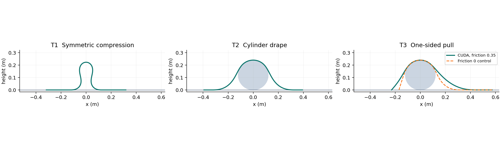
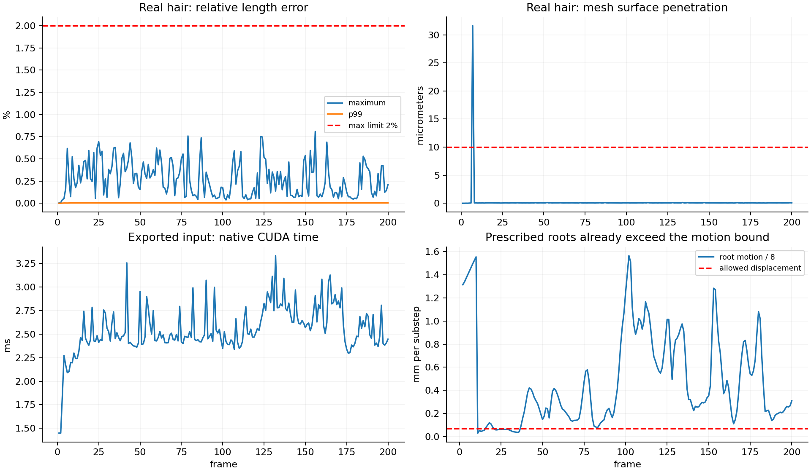

# 髪4 実行結果 — 2026-09-17

> 初版0.1.0の実測記録です。現行の採用版・局所順運動学 v2の結果と検証範囲は [エーシーズ現行設計書](ACES_DESIGN_JA.md) と [局所順運動学実験記録](experiments/local-fk-contact-20260917/README.md) を参照してください。下記の結果を現在の完全設定で再実行した結果とは扱いません。

**一括受入: 不合格。** 動作するブレンダー拡張、200フレームの計算・キャッシュ再生、3試験、10万点性能測定を作成した。未達を成功とは扱わない。機械可読の全判定は [受入判定記録](../outputs/acceptance.json)。

## 保存場所と入力

- 新規リポジトリ: `C:/Users/azoo/git/kami4-hair-solver`
- [現在のブレンダーと同じ入力を接続したシーン](../outputs/kami4_current_scene.blend)
- [拡張の全フレーム計算操作で検証したシーン](../outputs/kami4_verified_bake.blend)
- [インストール用圧縮書庫](../dist/kami4_hair_solver-0.1.0-windows-x64.zip)
- [共通設定ファイル](../extension/parameters.json)

保存シーンの操作用キャッシュは `outputs/scene_cache`。検証結果の原本 `outputs/real_final` とは別にしている。現在のブレンダーで 開始形状へ戻す → 1フレーム計算 → キャッシュ再生 を実行し、保存済み1フレームと座標が完全一致することを確認した。[実操作の確認](../outputs/live_verification.json)

ヘアーは「カーブ」6,757本・74,327点。コライダーは「身体メッシュ」225,184頂点・449,472三角形。原ファイル `C:\Users\azoo\gitlocal\bln_Lumi-1\pipleline-test\Lumi-1-HOU-HAIRFINISHED 4.blend` は上書きしていない。元の髪 / 髪3のコード・キャッシュも変更していない。

## 判定表

| 項目 | 実測 | 判定 |
|---|---|---|
| 試験1 中央圧縮 | 高さ 0.223093メートル、頂点x 0.000003メートル、主要浮いた 領域 1個 | 試験条件合格 |
| 試験2 円柱落下 | 最高点 0.240040メートル、左右材料長差 3.58×10⁻⁰⁷メートル | 試験条件合格 |
| 試験3 片側引張り | 左側材料長 0.154226メートル減少、摩擦あり滑り 347フレーム、摩擦係数=0は 1フレーム | 試験条件合格 |
| 3試験の共通設定 | B=1×10⁻⁶、減衰=8、摩擦係数=0.35、部分刻み数／補正回数／力積反復回数=4/3/3 | 合格 |
| 実髪完走 | 200/200フレーム、非数／無限値・毛束脱落・致命的な 誤差なし | 合格 |
| 実髪長さ | 最大 0.80832%、99百分位 0.003886% | 合格 |
| 実髪点接触 | 最大 31.609 µm侵入、許容10 µm | **不合格** |
| 移動上限 | 最大8分割でも指定根元移動が上限の 22.94倍 | **不合格** |
| 合成10万点 | 予備運転 120 + 計測600フレーム、接触点 [90909, 90909] | 合格 |
| 合成性能 | ネイティブ処理中央値 1.240ミリ秒、ブレンダー書き戻し込み 3.145ミリ秒 | 合格 |
| キャッシュ | 別ブレンダープロセスで200フレーム分の巡回冗長検査、1・7・100・200フレームを実再生 | 合格 |
| 中央処理装置／画像処理装置最終形 | 高さ・左右材料長は2%以内、滑り開始は一致、試験1微小残差の相対2%は未達 | **厳密比較は不合格** |

3試験は二次元拘束した同一の三次元カーネルで実行した。試験は毎秒240フレームで、試験1は8秒、試験2は5秒、試験3は8秒。試験1は100辺・全長1メートルの共通基準長で中央の初期の乱れから開始し、0.36メートル圧縮する。試験3は試験2の位置と速度を引き継ぎ、右端を0.18メートル引く。試験内の移動上限違反はすべて0だった。

## 実シーンの速度

評価済み入力を再生した実髪200フレームは、ネイティブ処理中央値 **2.493ミリ秒**、中央処理装置転送・位置取得込み **4.887ミリ秒**。

ブレンダー拡張の全フレーム計算操作では、身体と髪の評価を含め200フレームを **85.38秒**、平均 **0.427秒/フレーム**、中央値 **422.28ミリ秒/フレーム**。その実行中のネイティブ処理中央値は **26.89ミリ秒**。独立ベンチマークと実シーン内の時間を混同しない。この実シーン全体は24フレーム毎秒動作ではない。ネイティブ処理時間差の原因はここでは断定していない。ここで測定したのはヘアー計算・キャッシュ保存であり、サイクルズ／イーブイの画像レンダリング時間は未測定。

拡張全フレーム計算の最終座標と評価済み入力を使ったネイティブ処理実行との差は **0.0メートル**。入力の評価座標も抽出時から2×10⁻⁷メートル以内で一致した。

入力評価だけを1〜15フレームで計測した別の調査では、フレーム変更252.46ミリ秒、髪取得67.56ミリ秒、メッシュ取得58.38ミリ秒、合計378.34ミリ秒だった。非入力オブジェクトを隠した場合380.53ミリ秒、評価済みメッシュを直接読む場合380.08ミリ秒で改善しなかったため、これらの変更は採用していない。[測定値](../outputs/blender_evaluation_probe.json)

## 未達の再現

1. 最短辺は 0.000273042メートル、移動上限は 0.000068261メートル/部分刻み。102フレームの指定根元移動は 0.012527951メートル/フレーム。8分割でも 0.001565994メートル。毛束ごとの最短辺で条件を緩めても、毛束 1794で 20.81倍。これは求解前に決まる運動学的入力の問題であり、収束反復では解消できない。[数値と最小入力](../outputs/motion_bound_proof.json)
2. メッシュ接触の失敗は毛束 5396、11点、42,421三角形へ縮小して再現した。7フレームで約31.6µmの表面侵入が残る。`python tools/replay_failure.py` でブレンダーなしに再現できる。[再現用データ](../outputs/minimal_mesh_failure/fixture.npz)
3. 試験1の最終最大辺長残差は中央処理装置 1.59×10⁻⁰⁷、画像処理装置 1.31×10⁻⁰⁶。両者とも物理試験の1%を十分下回るが、残差自体を分母にした2%相対一致は満たさない。許容条件を変更して合格にはしていない。[全スカラー比較](../outputs/cpu_gpu_comparison.json)

## 実装と検証の範囲

- C++20/クーダ、不透明な 取っ手のC言語二進呼出規約。C11 利用側による作成・準備・刻み・取得・破棄を検証した。
- 独立参照実装等のパイソン試験15件が合格。非均一辺長、全6分類群、曲げ、長さ、全解析形状、摩擦、動く平面、無接触全経路、修復した根元接線、巡回冗長検査破損を含む。
- 全フレームで装置メモリー確保は0、実髪のカーネル数は129。クーダグラフは初期化時に一度だけ作成。
- 短い毛束は1スレッド、長い毛束はブロックでアフィン接頭処理と並列巡回縮約を使う。計測結果は [分類群の計測記録](../outputs/bucket_profile.json)。
- 初期化 / 1フレーム計算 / 開始形状へ戻す / 全フレーム計算 / キャッシュ再生と、再起動後のキャッシュ再生を検証した。
- メッシュ接触はユーザーの入力指定を優先して追加した両面点と表面方式。辺接触・体積内外保証・連続衝突判定はない。
- 投影による支持力積の整合処理を明示的に加えている。[数式上の補足と構造](ARCHITECTURE.md)

次の方式は [設計判断記録](ADR-001-acceptance.md) に一つだけ記した。原仕様を変更した合格版や、中央処理装置への代替実行・表示補正で隠した結果としては提出しない。

## 環境・ハッシュ値

エヌビディア ジーフォース アールティーエックス 5070 ティーアイ, 616.92 / ブレンダー 5.2.2 長期支援版 / クーダ開発環境 12.9.41 / マイクロソフトC/C++コンパイラ 19.44。

- 実行ファイルのハッシュ値: `ea2d71f02a40ee0db6820c097784c8795132edea0dee097b70dbdd445650f0c2`
- 設定のハッシュ値: `1a3e001805bf7fcf2b7e95eb7f1141c14d9226c4b2bd6b40984e51a754ac92a5`
- 配布物のハッシュ値: `e969b9d267a6cd13362a721a79a00353f3cb70be42d6d85068515b94bb69bb0f`
